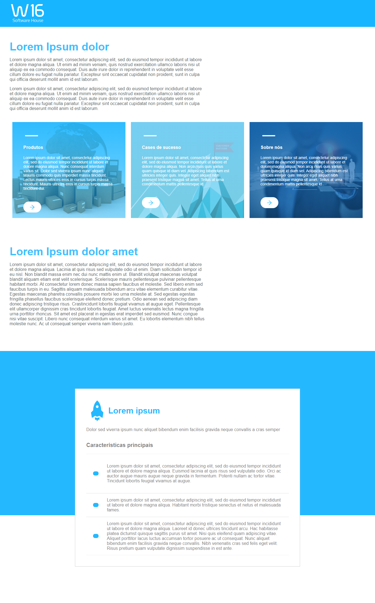

# Teste de Contratação W16 - Maio de 2020

<h1 align="center">
	W16
</h1>

 

  

<h4 align="center">
  Guilherme Fünkler Borelli
</h4>

  <a href="#wrench-tecnologias">Tecnologias</a>&nbsp;&nbsp;&nbsp;|&nbsp;&nbsp;&nbsp;
  <a href="#-projeto">Desafio</a>&nbsp;&nbsp;&nbsp;|&nbsp;&nbsp;&nbsp;
  <a href="#memo-observações">Observações</a>

## :wrench: Tecnologias

Esse projeto foi desenvolvido com as seguintes tecnologias:

- [React](https://reactjs.org)
- [React Icons](https://react-icons.github.io/react-icons/)
- [Styled Components](https://styled-components.com/)

## 💻 Projeto

O desafio consistia em reproduzir o layout apresentado.

## :memo: Observações
É necessário possuir Yarn ou NPM, utilize os comando abaixo de acordo com o que você possuir instalado.

Para rodar a aplicação utilizar o comando 'yarn'/'npm i' no diretório raiz do projeto , após concluída a instalação dos pacotes, utilizar os comandos 'yarn start'/'npm start' no mesmo diretório, a aplicação iniciará automaticamente.